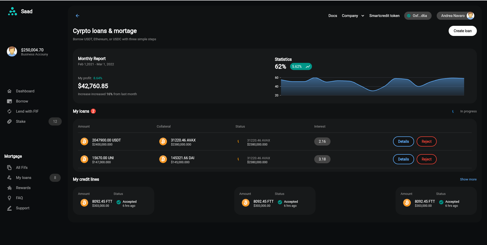

# Flutter Graph Websites

- [Me apoie no Patreon](https://patreon.com/carlosalbertopinto?fan_landing=true)

## Web de autenticação
 

## Aplicativo de criptografia e Web
 

## Estatísticas Financeiras

## DashBoard

<h2>🛠️ Funcionalidades e Componentes usados</h2>

-  syncfusion_flutter_charts - 20.3.49
-  responsive_framework - 0.2.0

# Design Credits:
- https://dribbble.com/shots/19562460-Smartcredit-Borrow-crypto
- https://dribbble.com/shots/16469084-Crypto-Dashboard
- https://dribbble.com/shots/16753965-Login-Sign-up-Dark-Mode-AW-Universal-Page
- https://dribbble.com/shots/17463994-Crypto-Wallet-Shot-Dark-Version

 
<h2>📝 Licença</h2>

   Esse repositório está sobre a Licença GNU General Public License v3.0, e você pode vê-la no arquivo <a href="https://github.com/caneto/calculator-app/blob/main/LICENSE">LICENSE</a> para mais detalhes. 😉

